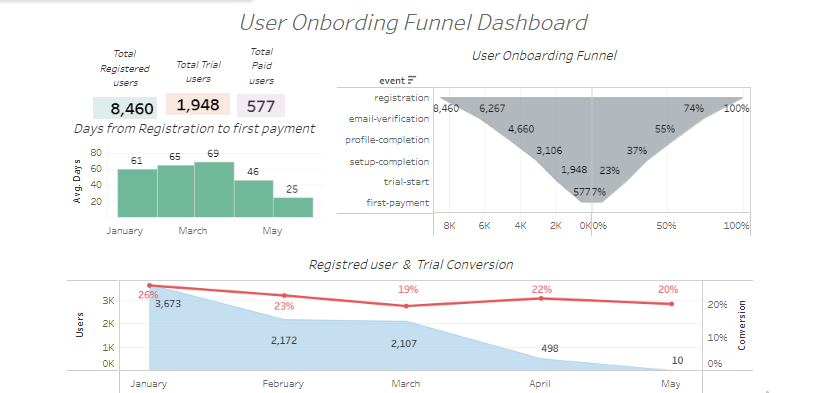

# User Onboarding Funnel Dashboard

## Overview
This project analyses the user journey from registration to first payment, identifying bottlenecks and conversion rates at each stage.

## Tools Used
- Tableau (data visualization and dashboard creation)
- Excel (data preparation)

## Business Questions Answered
- How many users register, start a trial, and become paying customers?
- At which step do we lose the highest percentage of users?
- How long does it take users to convert from registration to payment?
- How do monthly registrations impact conversion?

## Dashboard Components
1. **KPI Cards**  
   - Registered Users: 8,460  
   - Trial Users: 1,948 (23% conversion)  
   - Paid Users: 577 (7% conversion)  

2. **Funnel Chart**  
   - Displays progression across onboarding steps with both absolute numbers and conversion rates.  

3. **Line & Area Chart**  
   - Shows monthly registered users and trial conversion rate.  

4. **Bar Chart**  
   - Average days from registration to first payment by month.  

## Key Insights
- The biggest drop-off occurs at profile completion (only 37% continue).
- Trial-to-paid conversion stabilised around 20%.
- Time to payment improved from 69 days in March to 25 days in May.

## Live Dashboard
🔗 [View on Tableau Public](https://public.tableau.com/app/profile/bohdana.sakhno/viz/HWL6dashboardL_5_/HWL5)

## Files
- `/data` — anonymised dataset  
- `/screenshots` — dashboard visuals  
- `/project_docs` — detailed project report (PDF)

## Preview

